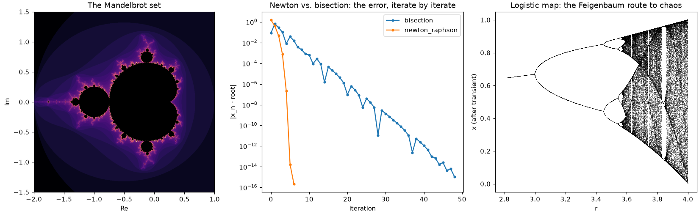

mathematicskit
==============

.. include:: /_generated/vars.rst

**mathematicskit** is a unified toolkit for computational mathematics, spanning
|num_subpackages| domains -- from abstract algebra and information theory
to statistical inference and topology -- under one NumPy-based API. It's built for mathematics
students working through a textbook problem, curious learners exploring
a topic on their own, and educators building a demonstration. Under the
hood, it calls `numpy`/`scipy` directly for anything they already
implement (decompositions, eigensolvers, quadrature, statistical
distributions, optimization routines, and more) -- mathematicskit's
value-add is its own dataclass-result API, docstrings, visualizers,
tests, and examples wrapped around those calls, not reinventing
numerical primitives that are already correct and well-tested upstream.
Algorithms are hand-rolled from first principles only where no
`numpy`/`scipy` equivalent exists (e.g. Dijkstra/Kruskal, finite
fields, modular arithmetic, Huffman and LDPC codes, the Smith normal
form, persistent homology), or where the algorithm's own iterate
behavior is itself the pedagogical subject (e.g. Newton's method's
convergence history, forward/reverse-mode autodiff). No hard dependency
on `networkx`, `cvxpy`, or SageMath.

Every subpackage is grounded in the mathematics it implements, not just
coded against it: public functions carry runnable, CI-checked examples,
and each subpackage's :doc:`history </history/index>` page traces the
breakthroughs behind it -- from Euclid's algorithm to the fast Fourier
transform -- each one linked to the code that reproduces it.

In short, mathematicskit is |num_subpackages| domains behind one
consistent API, plus a history-of-mathematics narrative in which every
milestone links to runnable gallery code. It is closest in spirit to a
teaching resource such as *Numerical Recipes* or the
`Scientific Python Lectures <https://lectures.scientific-python.org/>`_
(formerly the SciPy lecture notes), but packaged as an importable library.

.. important::

   Each domain is a teaching-depth subset of its field, not a complete
   implementation. mathematicskit is not a replacement for specialist
   libraries in production work: for that, use the dedicated tools
   (`SciPy <https://scipy.org/>`__,
   `NetworkX <https://networkx.org/>`__,
   `CVXPY <https://www.cvxpy.org/>`__,
   `statsmodels <https://www.statsmodels.org/>`__,
   `SymPy <https://www.sympy.org/>`__,
   `SageMath <https://www.sagemath.org/>`__,
   and the like) directly.

- :mod:`mathematicskit.abstract_algebra` -- cyclic/permutation groups, subgroups
  and cosets, finite fields, and polynomial ring arithmetic.

  .. image:: _static/images/readme_abstract_algebra.png
     :alt: Cayley tables of D4 and S4 and the multiplication table of GF(16)
     :width: 100%

- :mod:`mathematicskit.calculus` -- numerical differentiation/integration,
  forward- and reverse-mode automatic differentiation, and Taylor series.

  .. image:: _static/images/readme_calculus.png
     :alt: A midpoint Riemann sum, Taylor polynomials of sin, and adaptive quadrature sample points
     :width: 100%

- :mod:`mathematicskit.combinatorics` -- counting and generation, Pascal's
  triangle, integer partitions, inclusion-exclusion, and Stirling/
  Catalan/Bell numbers.

  .. image:: _static/images/readme_combinatorics.png
     :alt: Pascal's triangle, Pascal's triangle mod 2, and the partition function
     :width: 100%

- :mod:`mathematicskit.complex_analysis` -- the Cauchy-Riemann equations,
  contour integrals, Cauchy's integral theorem and formula, residues and
  the argument principle, conformal maps, and domain coloring.

  .. image:: _static/images/readme_complex_analysis.png
     :alt: Domain coloring, Joukowski airfoils, and residue-theorem contours
     :width: 100%

- :mod:`mathematicskit.fractals_chaos` -- Lyapunov exponents, box-counting
  fractal dimension, Mandelbrot/Julia sets, iterated function systems,
  and cellular automata.

  .. image:: _static/images/readme_fractals_chaos.png
     :alt: Barnsley's fern, a Julia set, and Wolfram's rule 30
     :width: 100%

- :mod:`mathematicskit.geometry` -- convex hull, Delaunay triangulation/Voronoi
  diagrams, segment intersection/point-in-polygon, polygon area/
  centroid, and the Frenet-Serret frame.

  .. image:: _static/images/readme_geometry.png
     :alt: Voronoi diagram, Delaunay triangulation, and a Bézier curve by de Casteljau
     :width: 100%

- :mod:`mathematicskit.graph_theory` -- shortest paths, minimum spanning trees,
  maximum flow/minimum cut, graph coloring, and spectral graph theory.

  .. image:: _static/images/readme_graph_theory.png
     :alt: Spectral bipartition, A* search, and a four-colored map
     :width: 100%

- :mod:`mathematicskit.information_theory` -- entropy and mutual
  information, Shannon-Fano, Huffman and arithmetic coding, Lempel-Ziv,
  channel capacity and rate-distortion, and Hamming, convolutional
  (Viterbi) and LDPC codes.

  .. image:: _static/images/readme_information_theory.png
     :alt: A Huffman code tree, an information diagram, and bit error rates of Hamming and convolutional codes
     :width: 100%

- :mod:`mathematicskit.linalg` -- LU/QR/Cholesky decompositions, symmetric
  eigenvalue algorithms, SVD, iterative Krylov solvers, and least-squares
  numerical stability.

  .. image:: _static/images/readme_linalg.png
     :alt: SVD low-rank approximations, Gershgorin discs, and conjugate-gradient vs. GMRES residuals
     :width: 100%

- :mod:`mathematicskit.number_theory` -- modular arithmetic, primality testing,
  the Chinese Remainder Theorem, continued fractions, multiplicative
  functions, and Diophantine equation solvers.

  .. image:: _static/images/readme_number_theory.png
     :alt: Prime-counting function, continued-fraction convergents of pi, and Fermat's two-squares primes
     :width: 100%

- :mod:`mathematicskit.numerical_analysis` -- root finding with convergence-order
  verification, polynomial interpolation (Lagrange, Newton
  divided-difference, cubic splines, Chebyshev nodes), least-squares
  polynomial regression, floating-point arithmetic, and Newton/Broyden for
  nonlinear systems.

  .. image:: _static/images/readme_numerical_analysis.png
     :alt: Runge's phenomenon, its Chebyshev-node cure, and Bernstein polynomial approximation
     :width: 100%

- :mod:`mathematicskit.ode_dynamics` -- fixed-point stability, phase portraits,
  the logistic map, bifurcation normal forms, limit cycles, and Poincare
  sections.

  .. image:: _static/images/readme_ode_dynamics.png
     :alt: Pendulum phase portrait, the Lorenz attractor, and a Poincaré section of the Duffing oscillator
     :width: 100%

- :mod:`mathematicskit.optimization` -- gradient descent, nonlinear conjugate
  gradient, Newton/BFGS, Lagrange/KKT constrained optimization, the
  penalty method, and linear programming.

  .. image:: _static/images/readme_optimization.png
     :alt: Optimizer paths on Rosenbrock's function, CG vs. gradient descent convergence, and a linear program
     :width: 100%

- :mod:`mathematicskit.pde` -- heat, wave, advection, and Poisson/Laplace
  problems: the method of lines, Crank-Nicolson, CFL and von Neumann
  stability, and Fourier/Chebyshev spectral methods.

  .. image:: _static/images/readme_pde.png
     :alt: 2D heat equation, wave-equation space-time diagram, and a Burgers shock
     :width: 100%

- :mod:`mathematicskit.probability` -- discrete/continuous distributions, Monte
  Carlo integration with variance reduction, the Law of Large Numbers and
  Central Limit Theorem, and discrete-time Markov chains.

  .. image:: _static/images/readme_probability.png
     :alt: Central limit theorem histogram, Brownian motion paths, and Monte Carlo integration
     :width: 100%

- :mod:`mathematicskit.special_functions` -- gamma/beta functions, Bessel
  functions, orthogonal polynomial families, and the discrete Fourier
  transform (naive DFT vs. radix-2 FFT vs. ``numpy.fft``).

  .. image:: _static/images/readme_special_functions.png
     :alt: Bessel functions, a Morlet wavelet scalogram, and the Cornu spiral
     :width: 100%

- :mod:`mathematicskit.statistics` -- descriptive statistics, hypothesis tests,
  confidence intervals, OLS regression, and bootstrap resampling.

  .. image:: _static/images/readme_statistics.png
     :alt: Regression fit, OLS residuals, and group box plots
     :width: 100%

- :mod:`mathematicskit.topology` -- simplicial complexes, integer homology
  by the Smith normal form, the fundamental group, the classification of
  surfaces, fixed-point theorems, and persistent homology of point clouds.

  .. image:: _static/images/readme_topology.png
     :alt: Critical points on a torus, a Vietoris-Rips complex of a noisy circle, and its persistence diagram
     :width: 100%

**mathematicskit** is part of a family of packages --
`physicskit <https://cpoli.github.io/physicskit/>`_, **mathematicskit**
and `chemistrykit <https://cpoli.github.io/chemistrykit/>`_ -- that share
the same architecture, API conventions, and history-driven documentation.

Install and try it
------------------

.. code-block:: bash

   pip install "mathematicskit[fast]"   # with numba JIT acceleration (recommended)
   pip install mathematicskit           # pure numpy/scipy/matplotlib, e.g. for Pyodide

The ``fast`` extra adds `numba <https://numba.pydata.org/>`_, which compiles
the inner loops of ``ode_dynamics``, ``fractals_chaos``, ``pde``, and
``integrators``. Without it, those kernels run as plain Python with the same
results, only slower.

To try it without installing anything, open the
`quickstart notebook <https://colab.research.google.com/github/cpoli/mathematicskit/blob/main/notebooks/quickstart.ipynb>`__
in Colab, or use the **JupyterLite** button at the top of
every gallery example. Every gallery also has a download-all button for its
scripts and notebooks. The public API follows a documented
`stability and deprecation policy <https://github.com/cpoli/mathematicskit/blob/main/CONTRIBUTING.md#api-stability-and-deprecation-policy>`__.

Conventionally imported as ``mk``:

.. code-block:: python

   import numpy as np
   import mathematicskit as mk

   newton = mk.numerical_analysis.NewtonRaphson(lambda x: x**2 - 2, lambda x: 2 * x, x0=3.0, tol=1e-14).solve()
   print(newton.root, len(newton.history))  # every iterate is kept

   spline = mk.numerical_analysis.CubicSpline(x=[0, 1, 2, 3], y=[0, 1, 0, 1], boundary="natural")
   print(spline.evaluate(1.5))

.. toctree::
   :maxdepth: 2
   :caption: Subpackages
   :hidden:

   subpackages/index

.. toctree::
   :maxdepth: 2
   :caption: History
   :hidden:

   history/index

.. toctree::
   :maxdepth: 2
   :caption: Examples
   :hidden:

   examples/index

.. toctree::
   :maxdepth: 2
   :caption: API
   :hidden:

   api/index
